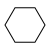
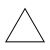
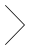
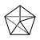
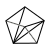
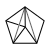
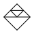

# Graph Decomposition

Suppose a connected graph `G` is decomposed into `F = {H1, H2, H3}` represented by:

Considering the nodes as the connection between two or more straight lines, which of the following graphs could *not* be `G`?

1. 
1. 
1. 
1. 
1. 
